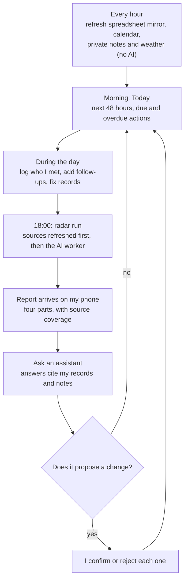
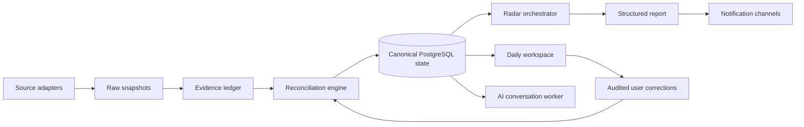

# LifeOps Atlas

<p align="right"><strong>English</strong> · <a href="README.zh-CN.md">简体中文</a></p>

> A personal operations system I use every day. It keeps one reliable record of
> the people I meet, the events I go to, the opportunities I find and the
> follow-ups I owe. Each evening an AI radar reports what is new, and it never
> changes my records without asking.

[](https://github.com/Zeeekrom/lifeops-atlas-showcase/actions/workflows/validate.yml)


**[Open the hosted synthetic demo](https://zeeekrom.github.io/lifeops-atlas-showcase/)**

This repository is a deliberately sanitised portfolio edition. It contains a
runnable synthetic-data demo and the design behind the system, but no
personal data, production prompts, credentials, provider identifiers or
private deployment configuration. Every screenshot here comes from the
synthetic demo.

## Contents

- [At a glance](#at-a-glance)
- [Why I built it](#why-i-built-it)
- [A day with it](#a-day-with-it)
- [The screens](#the-screens)
- [Real-world operating snapshot](#real-world-operating-snapshot)
- [Design principles](#design-principles)
- [Problems that became rules](#problems-that-became-rules)
- [Where AI is used, and where it is not](#where-ai-is-used-and-where-it-is-not)
- [Architecture](#architecture)
- [How it was built](#how-it-was-built)
- [Engineering highlights](#engineering-highlights)
- [Run the synthetic demo](#run-the-synthetic-demo)
- [What is not finished](#what-is-not-finished)
- [What I took from it](#what-i-took-from-it)
- [Public versus private](#public-versus-private)

## At a glance

| | |
|---|---|
| What it is | A local-first personal operations platform: daily workspace, relationship memory, opportunity radar and AI assistants |
| Who uses it | Me, every day since 16 Sep 2026 |
| The need | Building a network and a career in a new country produced more people, events and leads than a spreadsheet and chat prompts could keep straight |
| Stack | TypeScript, Fastify, PostgreSQL, Docker Compose, and a host-side AI agent worker with a model fallback chain |
| Scale | 245 people, 95 interactions, 108 opportunities and 194 radar findings as of 8 Oct 2026 |
| Tests | 84 automated tests in 18 files in the private codebase |
| Status | Running in shadow mode beside the workflow it is meant to replace |
| This repository | Synthetic demo, design notes and a publication check. Not the production code |

## Why I built it

When I moved to Australia to study, I had to build a professional network from
nothing while looking for work. Within a few months I was tracking hundreds of
people, dozens of events and a growing list of roles and companies.

My first system was one spreadsheet and four scheduled AI prompts. Each prompt
ran twice a day, searched for jobs, events and follow-ups, and wrote back to
the sheet. It worked until it did not:

- The four prompts overlapped. They searched the same things and wrote to the
  same places.
- The prompts and the chat history had quietly become the database.
- A report always looked complete, even when a source had failed or had never
  been checked.
- I could not ask the simplest question about any line in it: where did this
  come from?

I wanted a system that can say what it knows, where each fact came from, what
it checked in a given run and what failed.

## A day with it



1. **Every hour, no AI.** One cycle refreshes the spreadsheet mirror, the calendar, my private research notes and the weather. These steps call no model and cost no tokens.
2. **Morning.** The Today view shows the next 48 hours, what is due or overdue with countdowns, and a weather card.
3. **During the day.** After meeting someone I log the conversation and any follow-up. If the name could match two people, the record waits in a review queue. It is not guessed.
4. **18:00.** The radar refreshes its sources, then hands an AI worker a bounded snapshot of my current state. The worker returns structured findings in four parts: goals and timeline, events and networking, actions and follow-up, and career and organisations.
5. **Evening.** The report reaches a private channel on my phone. It lists which sources were checked and which failed, and its delivery status is stored.
6. **Any time.** I can ask an assistant about a person, an event or a past report. It answers from my records and research notes and cites them. If it proposes a change to a record, nothing happens until I confirm it.

## The screens

| | |
|---|---|
|  |  |
| **Today.** The next two days, priority actions and a weather summary written as decisions | **Radar.** Findings by part, duplicates blocked, and coverage per source. A partial source is shown as partial |
|  |  |
| **Networking.** Relationship stages by current state, and recent conversations with their channel | **Data quality.** The identity review queue and the order of trust used when sources disagree |

The demo is a product walkthrough with synthetic records. The private system
has four more views: AI chat, tasks, an overview and sync status.

## Real-world operating snapshot

<table>
  <tr>
    <td align="center"><strong>22+ days</strong><br><sub>Shadow operation since 16 Sep 2026</sub></td>
    <td align="center"><strong>245</strong><br><sub>Canonical people</sub></td>
    <td align="center"><strong>95</strong><br><sub>Interactions reconciled</sub></td>
    <td align="center"><strong>108</strong><br><sub>Opportunities tracked</sub></td>
  </tr>
  <tr>
    <td align="center"><strong>91</strong><br><sub>Upcoming events</sub></td>
    <td align="center"><strong>194</strong><br><sub>Deduplicated radar findings</sub></td>
    <td align="center"><strong>19</strong><br><sub>Reports delivered</sub></td>
    <td align="center"><strong>10</strong><br><sub>Ambiguous identities surfaced for review</sub></td>
  </tr>
</table>

Verified operational outcomes:

- The latest mirror check reconciled all 16 expected source tabs with zero
  failed tabs.
- The radar retained 194 structured, deduplicated findings instead of leaving
  discoveries only inside transient chat responses.
- Ten ambiguous identity records were held for explicit review rather than
  silently merged or treated as new people.
- Nineteen structured reports reached the notification lane while preserving
  delivery status for later audit.

_Snapshot captured 8 Oct 2026. These are manually published, selected
aggregates; this public repository has no live connection to the private
production database. The figures describe operating scale and verifiable
system behaviour, not guaranteed career or personal outcomes._

## Design principles

- **Imported data is evidence, not truth.** A spreadsheet row or a calendar entry is something a source said at a certain time. It is stored with its origin and a content hash, and it can be outranked.
- **My corrections win and stay won.** A change I make is stored as an audited correction and replayed after every later import, so a stale source cannot undo it.
- **Deletions are remembered.** A removed calendar event leaves a durable marker, so an older copy cannot bring it back.
- **AI proposes, I confirm.** Model text cannot change a record. A proposed change is validated against a schema, shown to me and applied only on confirmation.
- **A report must say what it checked.** Each run records the sources it covered. If a required source fails, the report cannot claim to be complete.
- **Failures are kept.** Quota limits, sign-in problems, malformed output and missed schedule windows each get a category, a bounded retry policy and a place in the interface.
- **The interface does not pretend.** If the weather source is down, the card says unavailable. A manual radar command shows as queued until it has actually run.
- **Routine work uses no AI.** Syncing, deduplication and reconciliation are deterministic code.
- **Run beside the old system first.** The new system mirrors the old spreadsheet read-only and is compared against it before anything is switched off.

When sources disagree, the order of trust is fixed:

1. An explicit confirmation or correction from me.
2. Verified current evidence.
3. Confirmed canonical state.
4. Imported source state.
5. Prompt defaults.
6. Model inference.

## Problems that became rules

Each of these happened in the old workflow or during the first sync. Each one
is now a rule in the system and a regression test.

| What went wrong | What the system does now |
|---|---|
| A contact was recommended to me again after we had already met | People have stable identities and a recorded relationship stage, and that state goes into every radar run |
| A calendar event I had deleted kept coming back | Deletions are stored as markers that outrank older copies |
| A rule I had set was ignored in a later run | Rules are stored as records in the database. They do not live inside a prompt |
| A local industry event was missed and the report still looked complete | Every run records its source coverage, and a failed source marks the report as incomplete |
| Text values changed type during the first sync | Each tab is compared by exact type and formula hashes, and every write is read back and verified |
| Two different people shared a display name | Ambiguous matches go to a review queue. They are not merged |

## Where AI is used, and where it is not

**Not used:** hourly source refresh, reconciliation, deduplication, scheduling and the dashboard figures.

**Used in two places:**

- **The evening radar.** The scheduler creates a durable job first. The AI worker then receives a bounded snapshot of current state and must return structured findings, source coverage and report sections. Output that does not match the contract is rejected and recorded as a failure.
- **The assistants.** There are seven persistent conversation spaces. One keeps every radar report as searchable history, and one analyses files I upload. The people and event assistants also retrieve from two private research collections, with bounded context, and cite the document and section they used.

**Around both:**

- A message is saved before the model is called, so a provider outage leaves the request queued. It is not lost.
- A fallback chain of independently authenticated models covers quota limits and outages.
- Retrieved text is evidence. It cannot overwrite a record.

## Architecture



The key boundary is that imported sources are evidence, not truth. Explicit
user corrections outrank stale source rows, and every state change retains its
origin and audit history.

The canonical model covers people, organisations, interactions, events,
opportunities, actions, rules, sources, incidents and regression specs.

Read the complete public-safe design in [Architecture](docs/architecture.md),
[Engineering decisions](docs/engineering-decisions.md), and
[Publication boundary](docs/publication-boundary.md).

## How it was built

| When | What happened |
|---|---|
| Mid Sep 2026 | Audited the old workflow. Saved the four scheduled prompts with their schedules, found that all four ran at the same two times each day with overlapping duties, and wrote down the failures above |
| 16 Sep 2026 | First verified mirror run. Eight tabs synced, eight already matched, and all 16 passed read-back. A type-conversion bug was found and fixed with new tests. Shadow operation began |
| By 4 Oct 2026 | Canonical database model, history import and identity resolution, then operational hardening: classified failures, bounded retries, expiry of stale jobs and model fallback |
| 5 Oct 2026 | Web control centre: Today, tasks, overview, radar, networking, data quality and sync views, then AI chat and retrieval from private notes |
| 6 Oct 2026 | Schedule simplified to one evening run that holds its local time across daylight-saving changes |
| 8 Oct 2026 | Snapshot published here |

The order was deliberate: make the mirror safe first (dry run, hashes,
read-back), then the model, then automation, then the interface.

## Engineering highlights

| Area | Approach |
| --- | --- |
| Data ownership | Source-owned snapshots, user-owned corrections and system-owned projections are stored separately |
| Reliability | Idempotent jobs, bounded retries, stale-job expiry and classified failures |
| Time | Canonical IANA timezone with daylight-saving regression tests |
| AI safety | Structured outputs, bounded context and confirmation-gated mutations |
| Privacy | Private production repository; synthetic public demo; automated publication scan |
| Operations | Container health checks plus a model-independent local bootstrap controller |
| Access | A responsive bilingual dashboard, reachable from a phone through a private network boundary |

## Run the synthetic demo

The demo has no backend and makes no network requests. Every record is clearly
marked as synthetic.

```bash
npm run validate:public
npm test
npm run dev
```

Then open <http://127.0.0.1:4173>.

The demo includes Today, Radar, Networking and Data Quality views, language
switching, drill-down panels and responsive layouts. It is intentionally a
product walkthrough rather than a copy of the private production interface.

## What is not finished

- It still runs as a shadow beside the old workflow. The old workflow has not been switched off.
- It runs on my own machine in containers. Cloud deployment is planned.
- A field-by-field comparison view for conflicts between the old sheet and the new records is the next interface slice.
- The radar depends on external model providers. A quota limit or an outage makes a run fail, visibly, until the fallback or the next retry succeeds.
- It is built for one user.

## What I took from it

- State belongs in a database. A prompt is a poor place to keep it.
- "What did it check?" matters as much as "what did it find?"
- Running beside the old system is cheap insurance. It caught problems before they cost me anything.
- AI is most useful when its input is bounded and its output is structured and reviewable.
- Recording failures honestly made me trust the system more.

## Public versus private

The production repository remains private because it contains personal domain
rules and connectors tied to real accounts. This public repository does not
share Git history with production and is not an automated mirror. Public
updates are reviewed as an explicit release step and pass the included
publication validator before push.

## Project status

The private system currently runs as a shadow lane beside an existing workflow.
The portfolio edition focuses on the engineering patterns that are reusable in
other personal-operations, CRM and agent-orchestration systems.

No licence is granted for reuse at this time. The repository is public for
technical review and portfolio evaluation.
