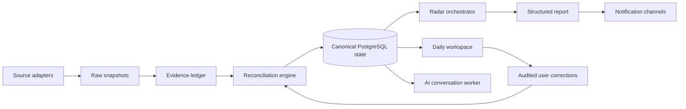

# LifeOps Atlas

> A privacy-safe engineering showcase of a personal operations platform that
> turns fragmented schedules, tasks, relationships and opportunity signals into
> an auditable daily decision system.

[](https://github.com/Zeeekrom/lifeops-atlas-showcase/actions/workflows/validate.yml)


LifeOps Atlas is a local-first system for coordinating daily actions, calendar
events, professional relationships, opportunities and recurring AI-assisted
research. It was designed to replace opaque prompt-and-spreadsheet workflows
with explicit state, provenance, reconciliation and failure visibility.

This repository is a deliberately sanitised portfolio edition. It contains a
runnable synthetic-data demo and the core architectural decisions, but no
personal data, production prompts, credentials, provider identifiers or
private deployment configuration.

## What the system demonstrates

- A canonical PostgreSQL model for people, interactions, events,
  opportunities, actions, evidence, incidents and automated runs.
- TypeScript/Fastify APIs that separate source ingestion from user-authored
  corrections and system-owned projections.
- A scheduled radar pipeline that records source coverage, failures,
  discoveries and delivery state instead of returning an untraceable answer.
- Read-only calendar and spreadsheet ingestion with deterministic
  reconciliation, deduplication and durable tombstones.
- Persistent AI conversations where messages survive provider outages and
  proposed data changes require explicit confirmation.
- A responsive bilingual dashboard, local recovery controller and mobile
  access through a private network boundary.

## Architecture



The key boundary is that imported sources are evidence, not truth. Explicit
user corrections outrank stale source rows, and every state change retains its
origin and audit history.

Read the complete public-safe design in [Architecture](docs/architecture.md),
[Engineering decisions](docs/engineering-decisions.md), and
[Publication boundary](docs/publication-boundary.md).

## Run the synthetic demo

The demo has no backend and makes no network requests. Every record is clearly
marked as synthetic.

**[Open the hosted synthetic demo](https://zeeekrom.github.io/lifeops-atlas-showcase/)**

```bash
npm run validate:public
npm test
npm run dev
```

Then open <http://127.0.0.1:4173>.

The demo includes Today, Radar, Networking and Data Quality views, language
switching, drill-down panels and responsive layouts. It is intentionally a
product walkthrough rather than a copy of the private production interface.

## Engineering highlights

| Area | Approach |
| --- | --- |
| Data ownership | Source-owned snapshots, user-owned corrections and system-owned projections are stored separately |
| Reliability | Idempotent jobs, bounded retries, stale-job expiry and classified failures |
| Time | Canonical IANA timezone with daylight-saving regression tests |
| AI safety | Structured outputs, bounded context and confirmation-gated mutations |
| Privacy | Private production repository; synthetic public demo; automated publication scan |
| Operations | Container health checks plus a model-independent local bootstrap controller |

## Public versus private

The production repository remains private because it contains personal domain
rules and connectors tied to real accounts. This public repository does not
share Git history with production and is not an automated mirror. Public
updates are reviewed as an explicit release step and pass the included
publication validator before push.

## Project status

The private system currently runs as a shadow lane beside an existing workflow.
The portfolio edition focuses on the engineering patterns that are reusable in
other personal-operations, CRM and agent-orchestration systems.

No licence is granted for reuse at this time. The repository is public for
technical review and portfolio evaluation.
