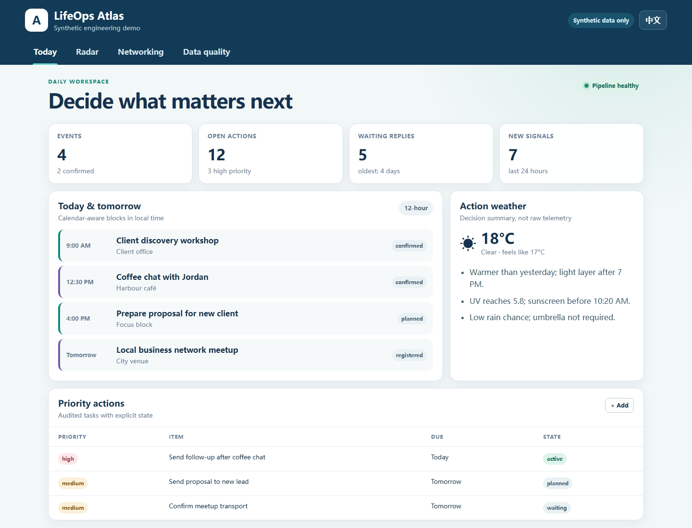
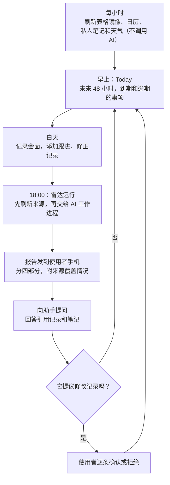
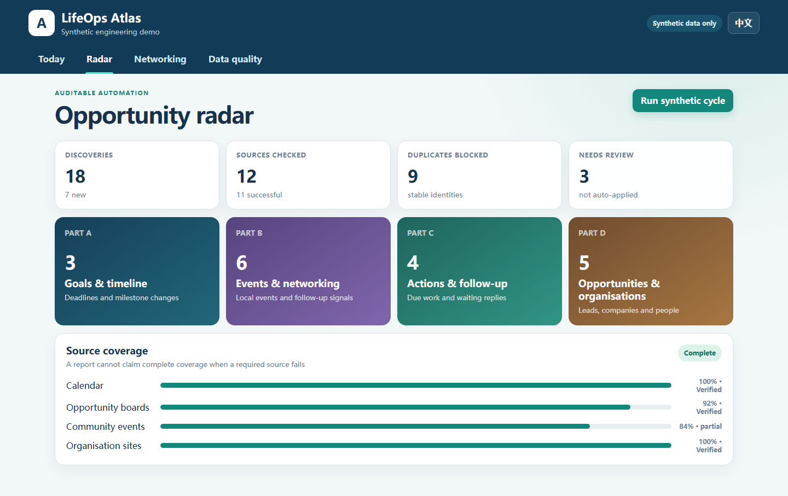
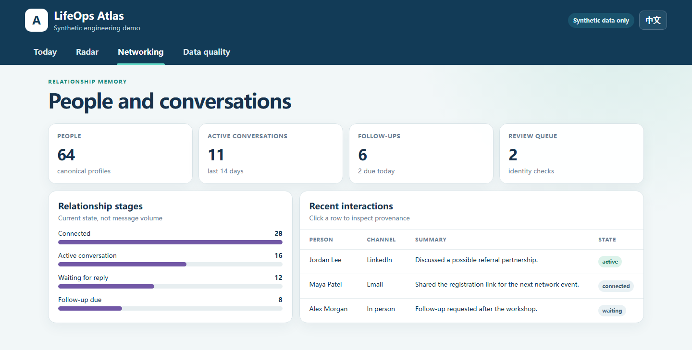
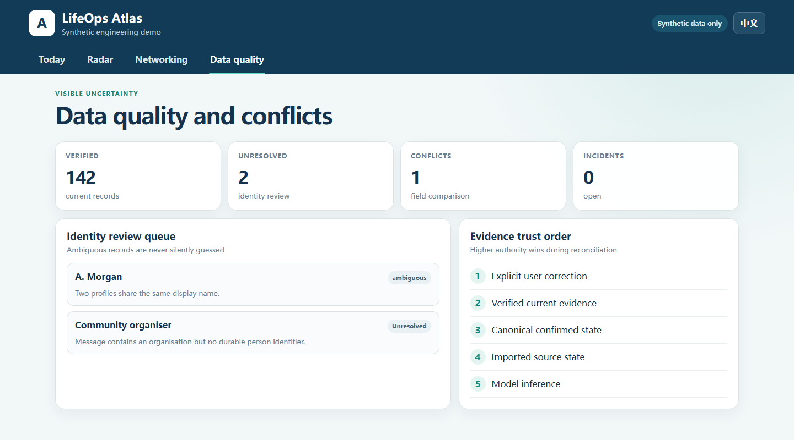
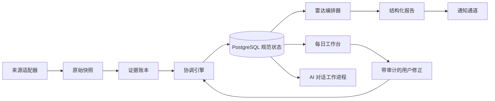

# LifeOps Atlas

<p align="right"><a href="README.md">English</a> · <strong>简体中文</strong></p>

> 为自己打理业务线索的人准备的运营系统：小企业主、顾问和独立从业者。它为联系人、活动、机会和待跟进事项
> 保留一份可靠的记录。每天傍晚，AI 雷达汇报有什么新情况，而且不经使用者确认，不会改动任何记录。

[](https://github.com/Zeeekrom/lifeops-atlas-showcase/actions/workflows/validate.yml)




**[打开在线的合成数据 Demo](https://zeeekrom.github.io/lifeops-atlas-showcase/)**

这是一个经过专门脱敏的作品集版本。仓库包含可运行的合成数据 Demo 和系统背后的设计，但不包含个人数据、生产提示词、凭据、服务商标识或私人部署配置。这里的每一张截图都来自合成数据 Demo。

## 目录

- [概览](#概览)
- [要解决的问题](#要解决的问题)
- [适合谁用](#适合谁用)
- [用它工作的一天](#用它工作的一天)
- [界面](#界面)
- [真实使用规模](#真实使用规模)
- [设计原则](#设计原则)
- [从问题变成规则](#从问题变成规则)
- [哪里用了 AI，哪里没用](#哪里用了-ai哪里没用)
- [系统架构](#系统架构)
- [搭建过程](#搭建过程)
- [工程亮点](#工程亮点)
- [运行合成数据 Demo](#运行合成数据-demo)
- [还没做完的部分](#还没做完的部分)
- [这个项目说明了什么](#这个项目说明了什么)
- [公开版与私有版边界](#公开版与私有版边界)

## 概览

| | |
|---|---|
| 是什么 | 面向关系型业务的本地优先运营平台：每日工作台、人脉记忆、机会雷达和 AI 助手 |
| 适合谁 | 业务线索散落在表格、日历和聊天工具里的经营者：小企业主、顾问、自由职业者和小团队 |
| 要解决的问题 | 联系人、活动、线索和跟进分散在各个工具里，而 AI 给出的汇总又无法核对 |
| 技术栈 | TypeScript、Fastify、PostgreSQL、Docker Compose，以及运行在宿主机上、带模型降级链的 AI Agent 工作进程 |
| 实际部署 | 一套单用户部署，自 2026 年 9 月 16 日起每天使用，已有 245 位人物、95 条互动和 108 个机会 |
| 测试 | 私有代码库中 18 个文件、84 条自动化测试 |
| 状态 | 以影子模式运行，与它将要替代的表格流程并行 |
| 本仓库 | 合成数据 Demo、设计说明和发布检查，不是生产代码 |

## 要解决的问题

小企业和独立从业者很少有专门的 CRM 团队。业务线索就放在一张表格、一个日历和几个聊天窗口里，越来越多的日常检查被交给定时运行的 AI 提示词。这种做法起步便宜，却很难让人放心。

LifeOps Atlas 最初就是为了替代这样一套做法：一张表格加四个定时运行的 AI 提示词，每个每天跑两次，去找机会、活动和待跟进事项，再把结果写回表格。用这种方式工作的人，对它的毛病不会陌生：

- 几个提示词的职责互相重叠，搜的是同样的东西，写的是同样的位置。
- 提示词和聊天记录不知不觉变成了数据库。
- 报告看起来永远是完整的，哪怕某个来源失败了，或者根本没查。
- 报告里的任何一行，都没人能回答最简单的问题：这是从哪儿来的？

目标是这样一个系统：它能说清自己知道什么、每条信息从哪里来、这一轮查了哪些来源、哪些失败了。

## 适合谁用

| 用户 | 常见情况 | 能得到什么 |
|---|---|---|
| 小企业主 | 线索、客户和合作方都在一张表格里，跟进全靠记性 | 每个人和每家机构一条记录，一份到期和逾期事项清单，以及每天傍晚的变化汇总 |
| 顾问或自由职业者 | 业务靠关系和转介绍而来 | 每次交流连同渠道和阶段都被保存，联系人冷掉之前就会被提醒跟进 |
| 小团队里负责商务拓展的人 | 每周有很多活动、很多新名字 | 活动和人关联在一起，重复的被拦下，拿不准的名字留待确认 |
| 用 AI 盯机会的任何人 | 每天收到无法核对的 AI 摘要 | 每条发现都带来源，记录查过哪些来源，数据不会被悄悄改动 |

目前它是一个单用户系统。第一套实际部署管理的是一位从业者的人脉和机会线索，下文的数字就来自这套部署。

## 用它工作的一天



1. **每小时一次，不用 AI。** 一个统一的周期刷新表格镜像、日历、私人调研笔记和天气。这几步不调用任何模型，不消耗 token。
2. **早上。** Today 页面显示未来 48 小时的安排、到期和逾期的事项及倒计时，还有一张天气卡片。
3. **白天。** 一次会面之后，记下这次交流和要做的跟进。如果名字可能对应两个人，这条记录会进入待确认队列，系统不会自己猜。
4. **18:00。** 雷达先刷新来源，再把当前状态的一份有界快照交给 AI 工作进程。它返回结构化的发现，分四部分：目标与时间线、活动与人脉、行动与跟进、机会与机构。
5. **傍晚。** 报告发到使用者手机上的一个私人频道，里面列出查了哪些来源、哪些失败了，发送状态也会被保存。
6. **任何时候。** 可以向助手询问某个人、某场活动或某份历史报告。它依据记录和调研笔记回答，并注明出处。如果它提议修改某条记录，在使用者确认之前什么都不会发生。

## 界面

| | |
|---|---|
|  |  |
| **Today。** 未来两天的安排、优先事项，以及写成行动建议的天气摘要 | **Radar。** 按部分列出的发现、被拦下的重复项，以及每个来源的覆盖情况。只查了一部分的来源会如实标成"部分" |
|  |  |
| **Networking。** 按当前状态统计的关系阶段，以及最近的交流和渠道 | **Data quality。** 身份待确认队列，以及来源冲突时采用的信任顺序 |

Demo 是用合成数据做的产品演示。私有系统还有四个页面：AI 对话、任务、总览和同步状态。

## 真实使用规模

以下数字来自第一套实际部署，一个单用户系统。

<table>
  <tr>
    <td align="center"><strong>22+ 天</strong><br><sub>自 2026-09-16 起影子运行</sub></td>
    <td align="center"><strong>245</strong><br><sub>规范人物记录</sub></td>
    <td align="center"><strong>95</strong><br><sub>已协调互动记录</sub></td>
    <td align="center"><strong>108</strong><br><sub>跟踪中的机会</sub></td>
  </tr>
  <tr>
    <td align="center"><strong>91</strong><br><sub>未来活动</sub></td>
    <td align="center"><strong>194</strong><br><sub>去重后的雷达发现</sub></td>
    <td align="center"><strong>19</strong><br><sub>已发送报告</sub></td>
    <td align="center"><strong>10</strong><br><sub>待人工确认的身份歧义</sub></td>
  </tr>
</table>

已经验证的运行效果：

- 最近一次镜像检查成功协调全部 16 个预期来源页，失败页为 0。
- 雷达已沉淀 194 条结构化且去重的发现，不再只把信息留在一次性聊天回复中。
- 10 条存在身份歧义的记录被保留给人工确认，没有被系统静默合并或误判为新人。
- 19 份结构化报告已进入通知通道，并保留发送状态以供后续审计。

_数据快照采集于 2026 年 10 月 8 日。这里只手工发布经过筛选的聚合数字；公开仓库不会实时连接私人生产数据库。以上指标说明系统的实际运行规模和可验证行为，不代表对业务或其他个人结果的保证。_

## 设计原则

- **导入的数据是证据，不是事实。** 表格里的一行、日历上的一条，只是某个来源在某个时间的说法。它连同来源和内容哈希一起保存，并且可以被更高权威的信息覆盖。
- **使用者的修正优先，而且一直有效。** 手动做的修改会存成一条带审计的修正记录，每次后续导入之后都会重放，过期的来源数据改不回去。
- **删除会被记住。** 被删掉的日历事件会留下持久标记，旧的副本没法让它复活。
- **AI 只提议，由使用者确认。** 模型输出的文字不能直接改记录。提议的修改先按结构校验，展示给使用者，确认后才生效。
- **报告必须说明查了什么。** 每次运行都记录覆盖了哪些来源。必需的来源失败时，报告不能声称自己是完整的。
- **失败要留痕。** 额度用尽、登录失效、输出格式不合规、错过调度窗口，各有分类、有上限的重试策略，并在界面上可见。
- **界面不装样子。** 天气来源不可用时，卡片就显示不可用。手动触发的雷达命令在真正执行之前只显示"已排队"。
- **日常工作不用 AI。** 同步、去重和协调都是确定性的代码，运行成本不会随着每次刷新增加。
- **先和旧系统并行。** 新系统以只读方式镜像现有表格并与之比对，确认稳定之前不停用任何旧流程。上手不需要一次有风险的切换。

来源冲突时，信任顺序是固定的：

1. 使用者的明确确认或修正。
2. 经过验证的当前证据。
3. 已确认的规范状态。
4. 导入的来源状态。
5. 提示词里的默认值。
6. 模型的推断。

## 从问题变成规则

下面每一条都在表格流程或第一次同步时真实发生过，现在都成了系统里的一条规则和一条回归测试。

| 出过什么问题 | 现在系统怎么做 |
|---|---|
| 已经见过面的联系人又被推荐了一次 | 人物有稳定的身份和记录在案的关系阶段，这些状态会进入每一次雷达运行 |
| 已删除的日历事件反复出现 | 删除被存成标记，优先级高于旧副本 |
| 使用者定过的一条规则在后来的运行里被忽略 | 规则作为记录存在数据库里，而不是写在提示词里 |
| 漏掉了一场本地行业活动，报告却看起来是完整的 | 每次运行记录来源覆盖情况，来源失败会把报告标为不完整 |
| 第一次同步时文本值被自动转换了类型 | 每个页签按精确的类型和公式哈希比对，每次写入后都回读校验 |
| 两个不同的人显示名相同 | 有歧义的匹配进入待确认队列，不会被合并 |

## 哪里用了 AI，哪里没用

**没用 AI 的地方：** 每小时的来源刷新、协调、去重、调度，以及 Dashboard 上的数字。

**用了 AI 的两处：**

- **傍晚的雷达。** 调度器先创建一条持久化的任务，AI 工作进程再拿到一份当前状态的有界快照，必须返回结构化的发现、来源覆盖情况和报告分节。不符合约定格式的输出会被拒绝，并记为一次失败。
- **助手。** 共有七个持久化的对话空间，其中一个把每份雷达报告保存为可检索的历史，一个用来分析上传的文件。人物助手和活动助手还会从两个私人调研资料库里检索，上下文有上限，并注明引用的文档和章节。

**两处共同的保护：**

- 消息在调用模型之前先保存，所以服务商中断时请求只是排队，不会丢失。
- 多个独立认证的模型组成降级链，应对额度限制和服务中断。
- 检索到的文本只是证据，不能覆盖记录。

## 系统架构



最关键的边界是：导入的来源是证据，不是事实。用户的明确修正优先于过期的来源数据，每一次状态变化都保留来源和审计历史。

规范数据模型涵盖人物、机构、互动、活动、机会、行动、规则、来源、事故和回归用例。

完整的公开版设计见 [Architecture](docs/architecture.md)、[Engineering decisions](docs/engineering-decisions.md) 和 [Publication boundary](docs/publication-boundary.md)。

## 搭建过程

| 时间 | 做了什么 |
|---|---|
| 2026 年 9 月中旬 | 审计现有流程：保存四个定时提示词及其时间表，发现四个任务每天都在同样的两个时间点运行、职责重叠，并把上面那些失败案例记录下来 |
| 2026 年 9 月 16 日 | 第一次通过验证的镜像运行：8 个页签完成同步，8 个原本一致，16 个全部通过回读校验。期间发现并修复了一个类型转换问题，补了测试。影子运行从这天开始 |
| 到 2026 年 10 月 4 日 | 规范数据库模型、历史数据导入和身份解析，然后是运行加固：失败分类、有上限的重试、过期任务清理和模型降级 |
| 2026 年 10 月 5 日 | 网页控制中心：Today、任务、总览、雷达、人脉、数据质量和同步页面，之后是 AI 对话和私人笔记检索 |
| 2026 年 10 月 6 日 | 调度简化为每天傍晚一次，跨夏令时切换也保持同一个本地时间 |
| 2026 年 10 月 8 日 | 在这里发布数据快照 |

顺序是有意安排的：先把镜像做安全（演练模式、哈希、回读），再做数据模型，然后是自动化，最后才是界面。

## 工程亮点

| 方面 | 做法 |
| --- | --- |
| 数据归属 | 来源快照、用户修正和系统投影分开存储 |
| 可靠性 | 幂等任务、有上限的重试、过期任务清理和失败分类 |
| 时间 | 统一使用 IANA 时区，并有夏令时回归测试 |
| AI 安全 | 结构化输出、有界上下文、修改必须经确认 |
| 隐私 | 生产仓库私有；公开 Demo 使用合成数据；发布前自动扫描 |
| 运维 | 容器健康检查，以及不依赖模型的本地启动控制器 |
| 访问 | 响应式双语 Dashboard，可通过私有网络在手机上访问 |

## 运行合成数据 Demo

Demo 没有后端，不发起任何网络请求，每条记录都明确标注为合成数据。

```bash
npm run validate:public
npm test
npm run dev
```

然后打开 <http://127.0.0.1:4173>。

Demo 包含 Today、Radar、Networking 和 Data Quality 四个页面，支持语言切换、下钻面板和响应式布局。它是一个产品演示，而不是私有生产界面的复制品。

## 还没做完的部分

- 目前仍以影子模式与表格流程并行，那套流程还没有停用。
- 它是单用户的。账号、角色和不同机构之间的隔离都还没有做。
- 系统运行在一台机器的容器里，托管部署在计划中。
- 要接入另一家企业的数据，需要为它自己的表格格式做一套导入映射。目前导入器只认识一种格式。
- 下一个要做的界面，是表格和新记录之间按字段对比冲突的视图。
- 雷达依赖外部模型服务商。额度用尽或服务中断会让一次运行失败，并且这个失败是可见的，直到降级模型或下一次重试成功。

## 这个项目说明了什么

- 状态应该放在数据库里，提示词不是存状态的地方。
- "它查了什么"和"它查到了什么"一样重要。
- 和现有流程并行运行是很便宜的保险，问题在造成损失之前就暴露了。
- 输入有边界、输出有结构并且可以复核时，AI 最有用。
- 如实记录失败，报告才值得信任。

## 公开版与私有版边界

生产仓库保持私有，因为其中包含个人领域规则和绑定真实账号的连接器。这个公开仓库不与生产仓库共享 Git 历史，也不是自动镜像。公开内容的更新是一个单独的、经过人工复核的发布步骤，推送前必须通过仓库内的发布校验脚本。

## 项目状态

私有系统目前以影子通道的形式与原有流程并行运行。作品集版本侧重展示可以复用到其他个人运营、CRM 和 Agent 编排系统中的工程模式。

目前不授予任何复用许可。仓库公开仅用于技术评审和作品集评估。
