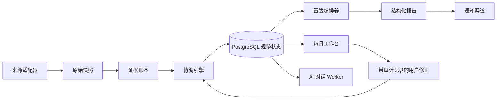

# LifeOps Atlas

<p align="right"><a href="README.md">English</a> · <strong>简体中文</strong></p>

> 一个注重隐私安全的个人运营平台工程展示：将分散的日程、任务、人际关系和机会信号，转化为可审计的每日决策系统。

[](https://github.com/Zeeekrom/lifeops-atlas-showcase/actions/workflows/validate.yml)


LifeOps Atlas 是一个本地优先的个人运营系统，用于协调每日行动、日历活动、职业关系、机会信息和周期性 AI 辅助检索。它的设计目标，是用明确的状态、数据来源、协调规则和失败记录，替代不透明的“超长提示词 + 表格”工作流。

这是一个经过专门脱敏的作品集版本。仓库包含可运行的合成数据 Demo 和核心架构决策，但不包含个人数据、生产提示词、凭据、服务商标识或私人部署配置。

## 真实使用规模

<table>
  <tr>
    <td align="center"><strong>22+ 天</strong><br><sub>自 2026-09-16 起影子运行</sub></td>
    <td align="center"><strong>245</strong><br><sub>规范人物记录</sub></td>
    <td align="center"><strong>95</strong><br><sub>已协调互动记录</sub></td>
    <td align="center"><strong>108</strong><br><sub>跟踪中的机会</sub></td>
  </tr>
  <tr>
    <td align="center"><strong>91</strong><br><sub>未来活动</sub></td>
    <td align="center"><strong>194</strong><br><sub>去重后的雷达发现</sub></td>
    <td align="center"><strong>19</strong><br><sub>已发送报告</sub></td>
    <td align="center"><strong>10</strong><br><sub>待人工确认的身份歧义</sub></td>
  </tr>
</table>

已经验证的运行效果：

- 最近一次镜像检查成功协调全部 16 个预期来源页，失败页为 0。
- 雷达已沉淀 194 条结构化且去重的发现，不再只把信息留在一次性聊天回复中。
- 10 条存在身份歧义的记录被保留给人工确认，没有被系统静默合并或误判为新人。
- 19 份结构化报告已进入通知通道，并保留发送状态以供后续审计。

_数据快照采集于 2026 年 10 月 8 日。这里只手工发布经过筛选的聚合数字；公开仓库不会实时连接私人生产数据库。以上指标说明系统的实际运行规模和可验证行为，不代表对求职或其他个人结果的保证。_

## 系统展示的能力

- 使用 PostgreSQL 建立人物、互动、活动、机会、行动、证据、事故和自动化运行的规范数据模型。
- 使用 TypeScript/Fastify API，将来源导入、用户修正和系统投影明确分离。
- 定时雷达记录来源覆盖、失败、发现和发送状态，而不是只返回一份无法追溯的答案。
- 以只读方式导入日历与表格，并通过确定性协调、去重和持久删除标记保护真实状态。
- AI 对话消息在调用模型前持久保存，服务商中断时不会丢失；数据修改必须经过用户明确确认。
- 提供响应式双语 Dashboard、本地恢复控制器，以及通过私有网络实现的移动端访问。

## 系统架构



系统最重要的边界是：导入来源是证据，而不是真相。用户明确确认的修正优先于过期来源行，并且每次状态变化都保留来源与审计历史。

完整的公开版设计说明见：[系统架构](docs/architecture.md)、[工程决策](docs/engineering-decisions.md)和[公开边界](docs/publication-boundary.md)。这些技术文档目前保留英文，以便工程审阅和检索。

## 运行合成数据 Demo

Demo 没有后端，也不会发出网络请求。所有记录均明确标记为合成数据。

**[直接打开在线合成数据 Demo](https://zeeekrom.github.io/lifeops-atlas-showcase/)**

```bash
npm run validate:public
npm test
npm run dev
```

然后打开 <http://127.0.0.1:4173>。

Demo 包含“今日”“雷达”“人脉”和“数据质量”页面，支持中英文切换、详情查看和响应式布局。它是产品能力演示，而不是私人生产界面的副本。

## 工程亮点

| 领域 | 实现方式 |
| --- | --- |
| 数据所有权 | 来源快照、用户修正和系统投影分别存储 |
| 可靠性 | 幂等任务、有限重试、过期任务处理和分类失败记录 |
| 时间 | 使用规范 IANA 时区，并通过夏令时回归测试 |
| AI 安全 | 结构化输出、有限上下文和用户确认后才执行修改 |
| 隐私 | 私有生产仓库、合成公开 Demo、自动公开内容扫描 |
| 运维 | 容器健康检查和不依赖 AI 模型的本地启动恢复控制器 |

## 公开版与私有版边界

生产仓库保持私有，因为其中包含个人领域规则以及与真实账户绑定的连接器。公开仓库与生产仓库没有共同 Git 历史，也不是自动镜像。每次公开更新都必须经过明确发布步骤，并在推送前通过公开内容校验器。

## 项目状态

私有系统目前以影子系统形式与现有工作流并行运行。作品集版本重点展示可以复用于个人运营、CRM 和 Agent 编排系统的工程模式。

本仓库目前未授予代码复用许可，仅供技术审阅和作品集评估。
