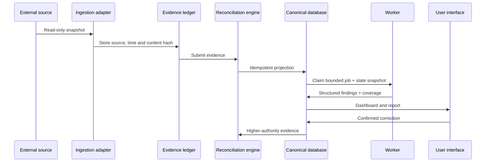

# Architecture

## Design goal

LifeOps Atlas converts unreliable conversational and spreadsheet state into a
system that can explain what it knows, where each fact came from, why a decision
was made and what failed during an automated run.

## Data flow

## Core components

### Source adapters

Adapters read spreadsheets, calendars, public web sources and uploaded files.
They never write directly to canonical business tables. Every ingestion keeps
the provider, observation time, source identity and content hash.

### Evidence and reconciliation

The evidence ledger allows conflicting statements to coexist until policy can
resolve them. A newer explicit correction can outrank an older imported row;
absence from a source never automatically proves that an interaction or event
did not happen.

### Canonical state

The canonical model covers people, organisations, interactions, events,
opportunities, actions, rules and incidents. Deterministic identifiers and
idempotent projections make repeated imports safe.

### Radar jobs

The scheduler creates a durable job before invoking an AI worker. The worker
receives a bounded state snapshot and must return structured discoveries,
source coverage and report sections. Failures remain visible with categories
such as provider quota, authentication, contract validation and stale schedule
window.

### Conversation worker

User messages are committed before model invocation. If the provider is
unavailable, the request remains queued. Free-form model text cannot mutate
canonical records; changes are schema-validated, shown to the user and applied
only after confirmation.

## Trust order

1. Explicit user confirmation or correction.
2. Verified current evidence.
3. Confirmed canonical state.
4. Imported source state.
5. Prompt defaults.
6. Model inference.

This order prevents a stale source row or confident model answer from silently
overwriting a known real-world update.
